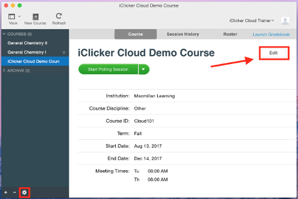
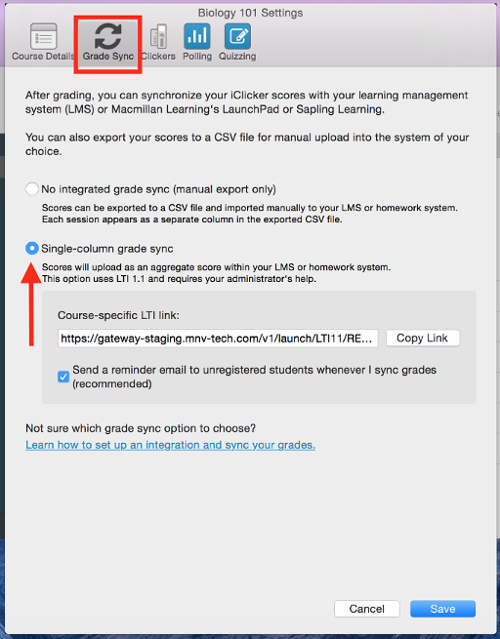
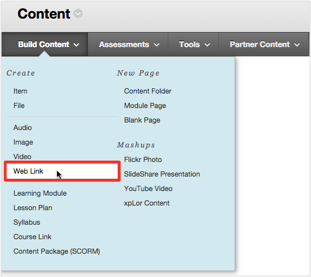
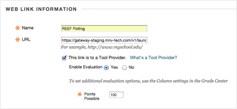

# iClicker LTI

iClicker Cloud uses Learning Tools Interoperability \(LTI\) standards to sync scores to the Blackboard Grade Center. This integration is an alternative to the manual export/import process with external CSV files.

As of Spring2018, iClicker Cloud grades sync to a single column in Blackboard. Every time you sync your scores, the column will be updated to reflect the new running total.

NOTE: Individual session scores can be manually exported from iClicker and then uploaded to Blackboard.

## 1. Select your course.

Open your iClicker Cloud app and select your course. Click either the gear icon in the side panel or the **Edit** button on your course dashboard.

## 2. Get the LTI link.

From the **Settings** window, select the **Grade Sync** tab and select "Single-column grade sync." Click **Copy Link** to copy the course-specific link.

NOTE: This link is unique for each iClicker Cloud course. You need to follow these directions precisely for each course you are teaching.

## 3. Add LTI link to your course.

> **\[info\] Edit Mode**
>
> Make sure that the course **Edit Mode** is set to **ON** from your Blackboard Course home page.

Choose an existing content area from your course navigation menu or create a new one to house your iClicker registration links. \(See "[Create a Link on Course Menu](https://help.blackboard.com/Learn/Instructor/Getting_Started/Navigate_Inside_a_Course)" for instructions.\)

Select **Build Content** to reveal a drop-down menu and select **Web Link** under the **Create **section of this menu.

## 4. Fill in the Web Link info

Complete the **Web Link Information** sections with the following information:

* Name: Reef Registration
* URL: \[_paste the URL copied from your iClicker Cloud course settings_\]
* This link is to a Tool Provider: checked
* Enable Evaluation: Yes
* Points Possible: \[_total points all Reef Sessions will be worth in your course\] \(you can change this at a later date\)_

## 5. Save

NOTE: Instruct your students to log into Blackboard and use the link that you created to register their Reef Student accounts.

You could also add an iClicker handheld registration link to this Blackboard page by expanding the Tools tab \(to the right of the Build Content tab\) =&gt; choose More Tools =&gt; i&gt;clicker Student Registration =&gt; Make Available = Yes =&gt; Submit. Make sure to clearly label the two different options.

